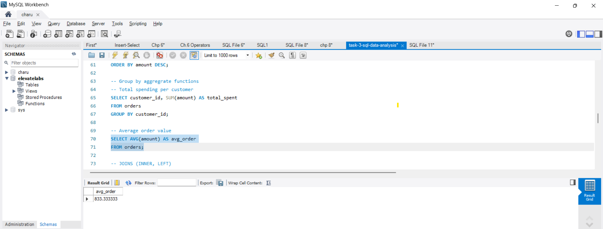
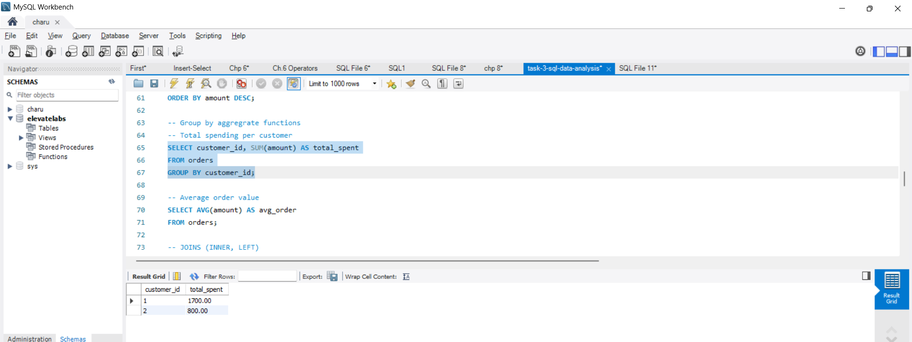
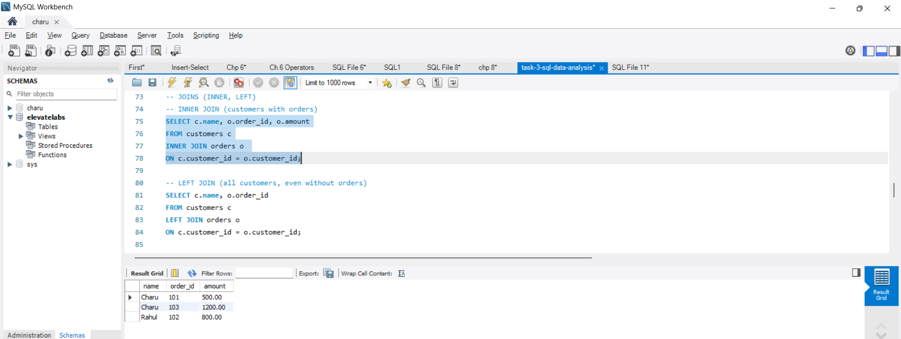
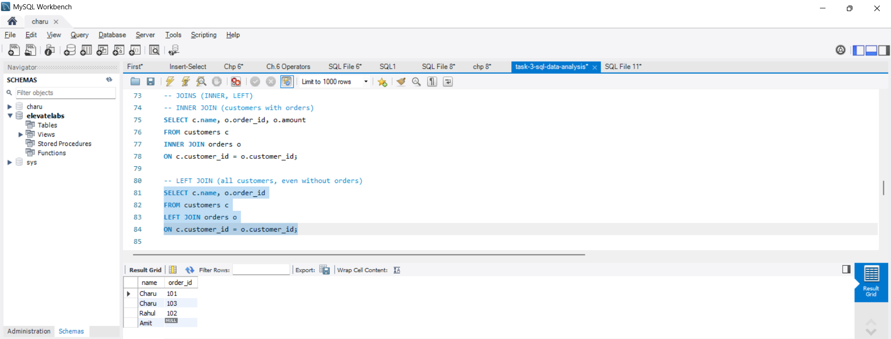
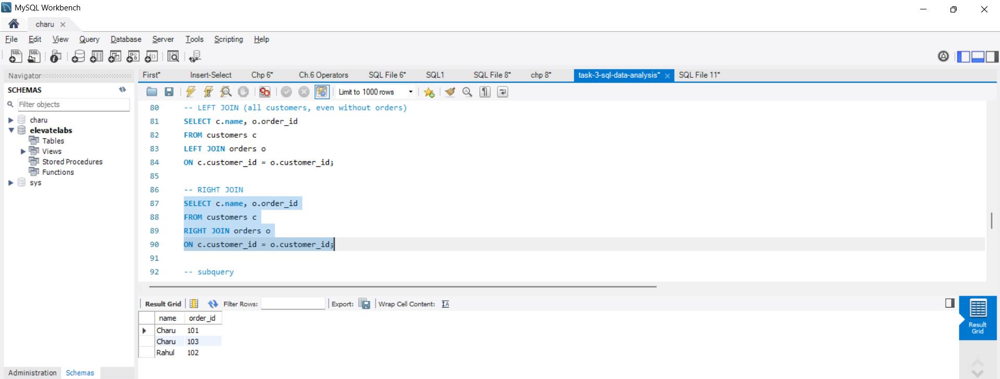
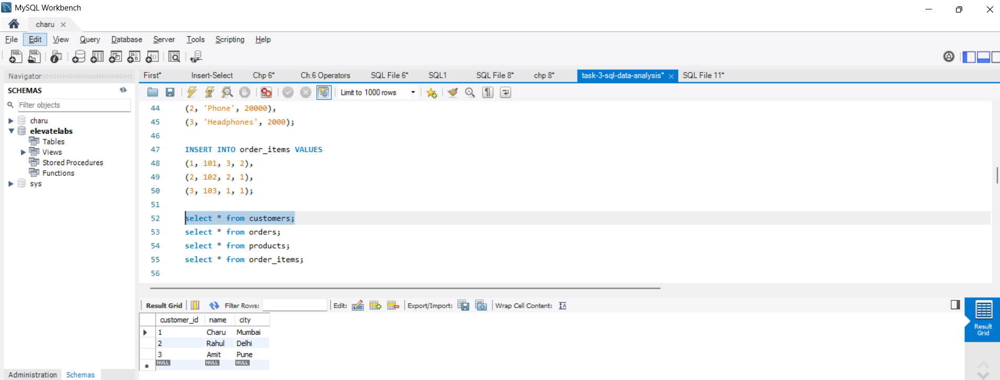
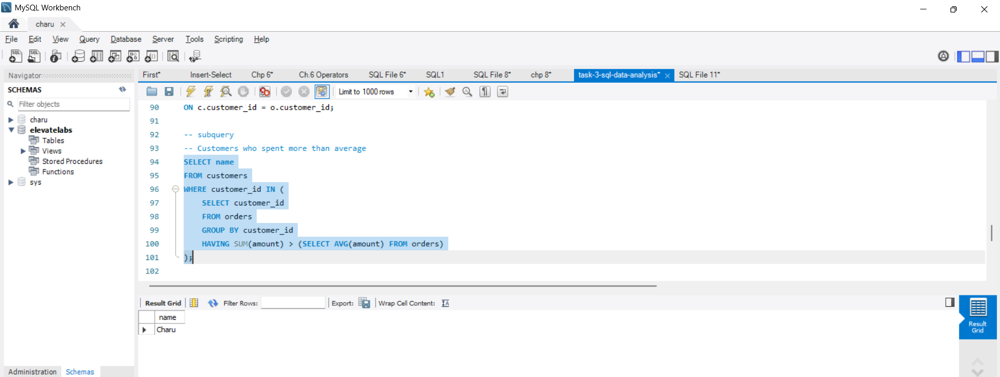
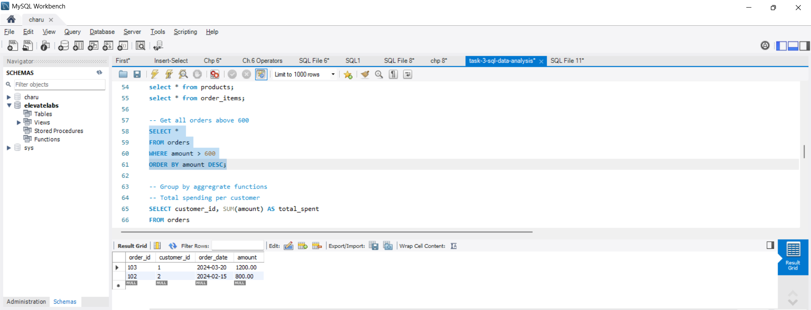

Objective

The objective of this task is to use SQL queries to extract, manipulate, and analyze data from a structured ecommerce database.

Tools Used

* MySQL

Dataset Description

A custom ecommerce dataset was created consisting of the following tables:

* Customers: Stores customer details such as ID, name, and city.
* Orders: Contains order information including order ID, customer ID, date, and amount.
* Products: Includes product details such as product ID, name, and price.
* Order_Items: Represents the relationship between orders and products along with quantity.

SQL Concepts Applied

The following SQL concepts were implemented in this task:

* Data retrieval using `SELECT`
* Data filtering using `WHERE`
* Sorting using `ORDER BY`
* Grouping data using `GROUP BY`
* Aggregate functions such as `SUM` and `AVG`
* Table relationships using `INNER JOIN` and `LEFT JOIN`
* Nested queries using subqueries
* Creation of reusable queries using `VIEW`
* Query optimization using `INDEX`

Key Analysis Performed

* Retrieved and filtered order data based on conditions
* Calculated total spending per customer
* Computed average order value
* Joined multiple tables to analyze relationships between customers and orders
* Identified customers with spending above average using subqueries
* Created a view for summarized customer spending

Screenshots

# Average Query Output

# Group By Output

# Inner Join Query Output

# Left Join Output

# Right Join Query Output

# Select Query Output

# Subquery Output

# WHERE + Group BY Output

Outcome

This task provided practical experience in using SQL for data analysis. It enhanced understanding of querying structured data, applying aggregation techniques, and optimizing database performance.
